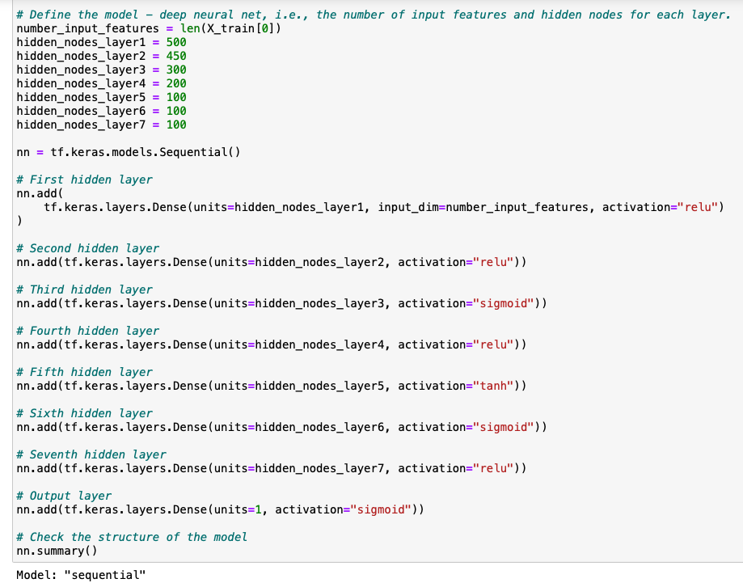

## deep-learning-challenge
U of T's SCS Data Analytics Boot Camp Challenge 21 - Deep Learning

# Credit Risk Analysis Report

# Overview
The purpose of this challenge assignment is to utilize Pandas and scikit-learn's standard scaler to preprocess a dataset that will be used to compile, train and evaluate the neural network model.  A dataset of a nonprofit foundation, Alphabet Soup is given and using this dataset, a tool is required to select applicants for funding with the best chance of success in their ventures.  Utilizing machine learning and neural networks, the goal is to use the features in the provided dataset to create a binary classifier that can predict whether applicants will be successful if funded by Alphabet Soup.  The dataset contains more than 34,000 organizations that have received funding from Alphabet Soup over the years. 

# Results
Data Preprocessing
* The target of the model is the IS_SUCCESSFUL column as this is the variable of the dataset that needs to be understood more clearly 
* The the feature variables are APPLICATION_TYPE, AFFILIATION, CLASSIFICATION, USE_CASE, ORGANIZATION, STATUS, INCOME_AMT, SPECIAL_CONSIDERATIONS, and ASK_AMT   
* EIN and NAME are identification columns and so these variables should be removed from the input data because they are neither targets nor features

Compiling, Training, and Evaluating the Model
* A total of seven hidden layers were used in the neural network model, in an effort to improve the accuracy of the model more hidden layers were added
* For the first layer, 500 neurons and the relu activation function was selected
* For the second layer, 450 neurons and the relu activation function was selected
* For the third layer, 300 neurons and the sigmoid activation function was selected
* For the fourth layer, 200 neurons and the relu activation function was selected
* For the fifth layer, 100 neurons and the tanh activation function was selected
* For the sixth layer, 100 neurons and the sigmoid activation function was selected
* For the seventh layer, 100 neurons and the relu activation function was selected

* More neurons were added to improve the accuracy of the model, and different activation functions were used in an effort to improve accuracy
* The target model performance was not acheived despite dropping columns, creating more bins for rare occurences in columns, decreasing the number of values in the "others" bins, and reducing the number of epoches to the training regimen

# Summary
Despite utlizing all methods to in an effort to optimize the performance of the machine learning model, the target of 75% accuracy was not achieved.  An alternative model to the Sequential model is the Functional model.  It is more a more flexible API and is more advanced.  The Functional model enables users to create models ina more complex manner as it helps define multiple numbers of input and output.  The Functional model enables uers to work with multiple layers and allows layers to be shared.

